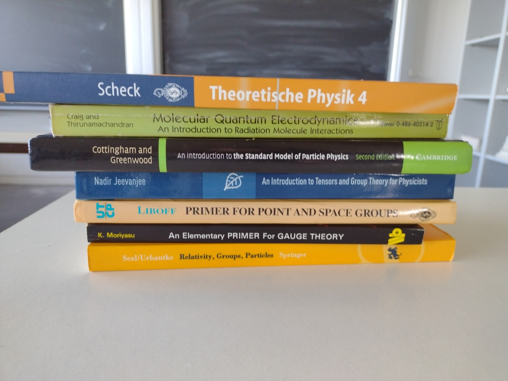

# Kontinuierliche Gruppen und ihre Anwendungen in der Quantenphysik Unikurs
Course of Kontinuierliche Gruppen und ihre Anwendungen in der Quantenphysik of University Potsdam

Github Repository with all notes

https://github.com/christiang7/Kontinuierliche_Gruppen_und_ihre_Anwendungen_in_der_Quantenphysik_Unikurs

Kurs: Symmetriegruppen in der Quantenphysik | Moodle.UP

https://moodle2.uni-potsdam.de/course/view.php?id=39751

## Books

